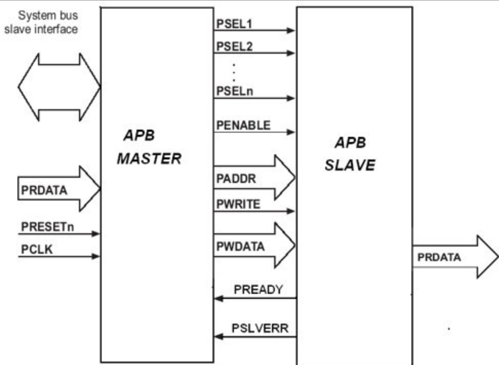
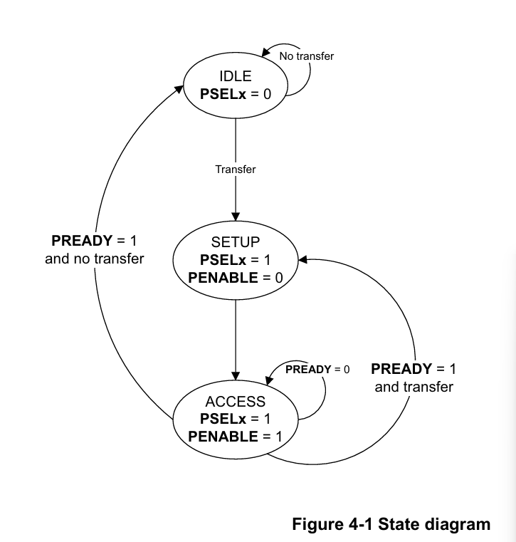

# APB Protocol: Master-Slave Implementation

This project demonstrates a **Verilog-based FSM (Finite State Machine)** implementation of the **AMBA APB (Advanced Peripheral Bus)** protocol. The design models the communication between a **Master (requester)** and a **Slave (completer)** using the APB protocol, widely used in low-bandwidth peripherals due to its simplicity and low power consumption.

---

## Overview

The Advanced Peripheral Bus (APB) is a low-power, low-complexity bus used to connect peripherals in a SoC. This project demonstrates the complete flow of an APB transaction using Verilog. Both the master and slave are implemented using finite state machines (FSMs) and the design is tested with a testbench and verified using waveform simulations.

---

## Key Features

- FSM-based APB Master and Slave architecture
- Read and Write transaction support
- Customizable `addrwidth` and `datawidth` parameters
- Address boundary checking with error signaling (`PSLVERR`)
- Testbench simulates APB protocol behavior
- Waveform-based validation of read/write operations

---

## Waveform Analysis

The following waveform represents a **write followed by a read** operation on the APB bus.

### Write Operation

- `PSEL` is asserted during SETUP phase
- `PENABLE` asserted in ACCESS phase
- `PWRITE = 1`, valid `PWDATA` and `PADDR`
- `PREADY` is asserted when the slave completes the write

### Read Operation

- `PWRITE = 0`
- `PRDATA` contains valid data
- `PREADY` marks end of read
- Master sets `done` high

Both operations follow the SETUP and ACCESS phase structure of APB.

---

## Signal Descriptions

### APB Master

| Signal     | Direction | Description                            |
|------------|-----|----------------------------------------|
| `start`    | In  | Starts a new transaction               |
| `write`    | In  | 1 = write, 0 = read                    |
| `addr`     | In  | Target address                         |
| `wdata`    | In  | Data to write                          |
| `rdata`    | Out | Data read from slave                   |
| `done`     | Out | Transaction complete                   |
| `psel`     | Out | Slave select                           |
| `penable`  | Out | Transfer enable                        |
| `paddr`    | Out | APB address bus                        |
| `pwrite`   | Out | Write control signal                   |
| `pwdata`   | Out | Write data bus                         |
| `prdata`   | In  | Data from slave                        |
| `pready`   | In  | Transaction ready signal from slave    |
| `pslverr`  | In  | Slave error signal                     |

### APB Slave

| Signal     | Direction | Description                            |
|------------|-----|----------------------------------------|
| `psel`     | In  | Slave select                           |
| `penable`  | In  | Transfer enable                        |
| `paddr`    | In  | Address from master                    |
| `pwrite`   | In  | Write control                          |
| `pwdata`   | In  | Data to write                          |
| `prdata`   | Out | Data to be read                        |
| `pready`   | Out | Transaction ready                      |
| `pslverr`  | Out | Error flag for invalid address         |

---

## State Diagram

