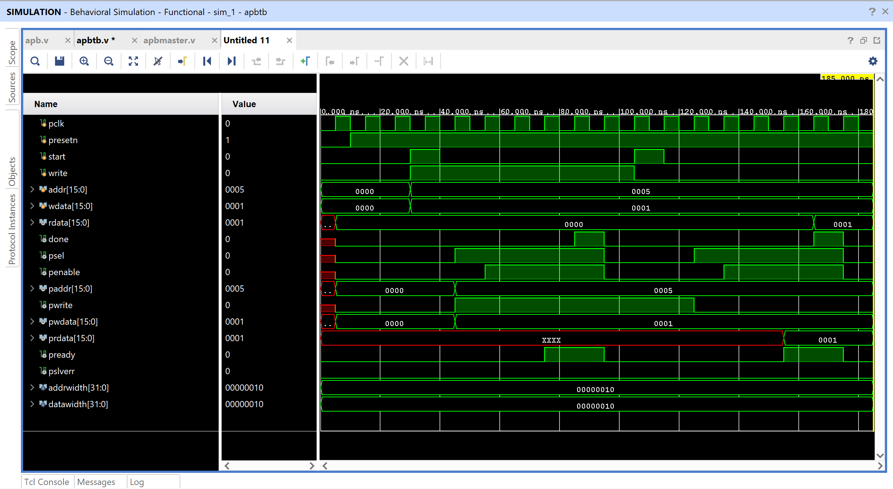

# APB Protocol: Master-Slave Implementation

This project demonstrates a **Verilog-based FSM (Finite State Machine)** implementation of the **AMBA APB (Advanced Peripheral Bus)** protocol. The design models the communication between a **Master (requester)** and a **Slave (completer)** using the APB protocol, widely used in low-bandwidth peripherals due to its simplicity and low power consumption.

---

## Overview

The Advanced Peripheral Bus (APB) is a low-power, low-complexity bus used to connect peripherals in a SoC. This project demonstrates the complete flow of an APB transaction using Verilog. Both the master and slave are implemented using finite state machines (FSMs) and the design is tested with a testbench and verified using waveform simulations.

---

## Key Features

- FSM-based APB Master and Slave architecture
- Read and Write transaction support
- Customizable `addrwidth` and `datawidth` parameters
- Address boundary checking with error signaling (`PSLVERR`)
- Testbench simulates APB protocol behavior
- Waveform-based validation of read/write operations

---

## Waveform Analysis

The following waveform represents a **write followed by a read** operation on the APB bus.

### Write Operation

- `PSEL` is asserted during SETUP phase
- `PENABLE` asserted in ACCESS phase
- `PWRITE = 1`, valid `PWDATA` and `PADDR`
- `PREADY` is asserted when the slave completes the write

### Read Operation

- `PWRITE = 0`
- `PRDATA` contains valid data
- `PREADY` marks end of read
- Master sets `done` high

Both operations follow the SETUP and ACCESS phase structure of APB.

---

## Signal Descriptions

### APB Master (Requester)

| Signal     | Direction | Description                                 |
|------------|-----------|---------------------------------------------|
| `start`    | Input     | Initiates a new APB transaction             |
| `write`    | Input     | 1 = Write operation, 0 = Read operation     |
| `addr`     | Input     | Target address for the transaction          |
| `wdata`    | Input     | Data to be written                          |
| `rdata`    | Output    | Data read from slave                        |
| `done`     | Output    | Indicates end of transaction                |
| `psel`     | Output    | Slave select signal                         |
| `penable`  | Output    | Enables the data phase                      |
| `paddr`    | Output    | Address line for the APB slave              |
| `pwrite`   | Output    | 1 = Write, 0 = Read                         |
| `pwdata`   | Output    | Data to be written                          |
| `prdata`   | Input     | Data read from the slave                    |
| `pready`   | Input     | Indicates slave is ready                    |
| `pslverr`  | Input     | Indicates error from slave (invalid address)|

---

### APB Slave (Completer)

| Signal     | Direction | Description                                 |
|------------|-----------|---------------------------------------------|
| `psel`     | Input     | Indicates slave is selected                 |
| `penable`  | Input     | Indicates data transfer phase is active     |
| `paddr`    | Input     | Address of register to read/write           |
| `pwrite`   | Input     | 1 = Write,0 = Read                          |
| `pwdata`   | Input     | Data from master to write                   |
| `prdata`   | Output    | Data sent to master                         |
| `pready`   | Output    | Indicates transaction completion            |
| `pslverr`  | Output    | High when address is out of range           |

---

## State Diagram

## Reference

- [ARM APB Protocol Specification](https://documentation-service.arm.com/static/60d5b505677cf7536a55c245?token=)

---
